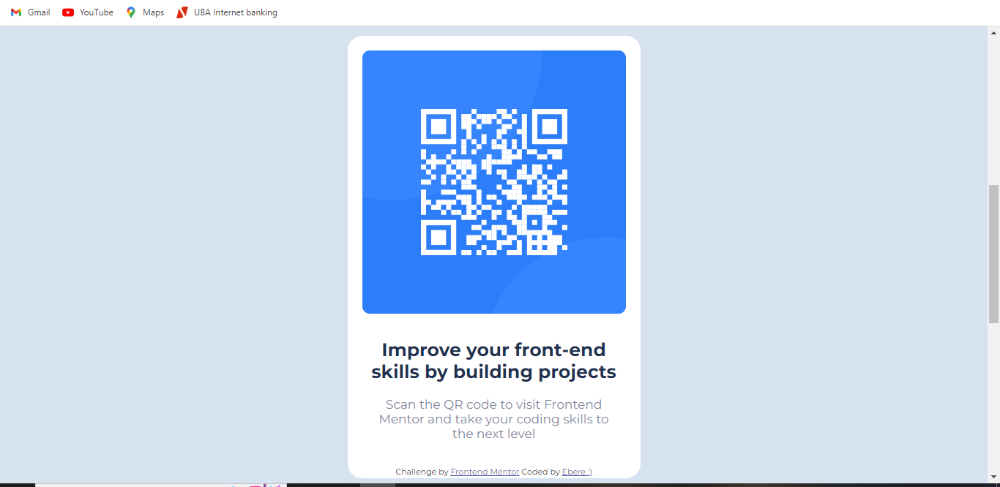

# Frontend Mentor - QR code component solution

This is a solution to the [QR code component challenge on Frontend Mentor](https://www.frontendmentor.io/challenges/qr-code-component-iux_sIO_H). Frontend Mentor challenges help you improve your coding skills by building realistic projects. 

## Table of contents

- [Overview](#overview)
  - [Screenshot](#screenshot)
  - [Links](#links)
- [My process](#my-process)
  - [Built with](#built-with)
  - [What I learned](#what-i-learned)
  - [Continued development](#continued-development)
  - [Useful resources](#useful-resources)
- [Author](#author)


## Overview
This is my first project in FrontEnd Mentor. It is a code for the QR component of a website. It bascially provides access to the FrontEnd Mentor website by scanning the given QR code. I hope you like my imitation. 

### Screenshot



### Links

- Solution URL: [Add solution URL here](https://github.com/eby-coder/fluffy-system.git)
- Live Site URL: [Add live site URL here](https://eby-coder.github.io/fluffy-system/)

## My process

### Built with

- Semantic HTML5 markup
- CSS custom properties
- CSS Grid
- Visual Studio Code


### What I learned

I learnt how to add colours using the var() property and how to import fonts from Google Fonts. It also helped me in remebering syntax and tags I had forgotten. 

```css
body {
    background-color: var(--light-gray);
    font-family: "Montserrat", sans-serif;
}
```


### Continued development

I will like to try out more projects on HTML and CSS for now. I will prefer beginner-intermediate CSS projects so that I can sharpen my skills. I would later like to progress to more complex challenges involving Javascript.  

### Useful resources

- [Resource 1](https://youtu.be/SR5GxoFhIAU) - This introduced me to FrontEnd Mentor and taught me how to accept challenges and submit soutions. It doesn't teach this challenge but it helped in understanding the basics.

## Author

- Website - [Ebere Ndukwu](https://www.i-don't-have-a-site-yet.com)
- Frontend Mentor - [@eby-coder](https://www.frontendmentor.io/profile/eby-coder)
